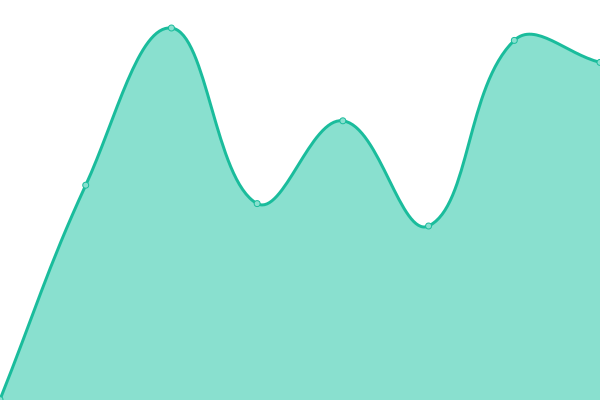

# [📈 Live Status](https://DaMnGoodIT.github.io/upptime): <!--live status--> **🟥 Complete outage**

This repository contains the open-source uptime monitor and status page for [DaMnGoodIT](https://damngoodit.de), powered by [Upptime](https://github.com/upptime/upptime).

With [Upptime](https://upptime.js.org), you can get your own unlimited and free uptime monitor and status page, powered entirely by a GitHub repository. We use [Issues](https://github.com/DaMnGoodIT/upptime/issues) as incident reports, [Actions](https://github.com/DaMnGoodIT/upptime/actions) as uptime monitors, and [Pages](https://DaMnGoodIT.github.io/upptime) for the status page.

<!--start: status pages-->
<!-- This summary is generated by Upptime (https://github.com/upptime/upptime) -->
<!-- Do not edit this manually, your changes will be overwritten -->
<!-- prettier-ignore -->
| URL | Status | History | Response Time | Uptime |
| --- | ------ | ------- | ------------- | ------ |
|  [Matrix - Synapse](https://matrix.b0t.at/health) | 🟥 Down | [matrix-synapse.yml](https://github.com/DaMnGoodIT/upptime/commits/HEAD/history/matrix-synapse.yml) | 

 4737ms
     
 | 

<a href="https://DaMnGoodIT.github.io/upptime/history/matrix-synapse">94.40%</a>
    

|  [b0t.at](https://b0t.at) | 🟥 Down | [b0t-at.yml](https://github.com/DaMnGoodIT/upptime/commits/HEAD/history/b0t-at.yml) | 

 6025ms
     
 | 

<a href="https://DaMnGoodIT.github.io/upptime/history/b0t-at">94.59%</a>
    

|  [Mastodon](https://social.b0t.at) | 🟥 Down | [mastodon.yml](https://github.com/DaMnGoodIT/upptime/commits/HEAD/history/mastodon.yml) | 

 3379ms
     
 | 

<a href="https://DaMnGoodIT.github.io/upptime/history/mastodon">94.81%</a>
    

<!--end: status pages-->

[**Visit our status website →**](https://DaMnGoodIT.github.io/upptime)

## 📄 License

- Powered by: [Upptime](https://github.com/upptime/upptime)
- Code: [MIT](./LICENSE) © [DaMnGoodIT](https://damngoodit.de)
- Data in the `./history` directory: [Open Database License](https://opendatacommons.org/licenses/odbl/1-0/)
