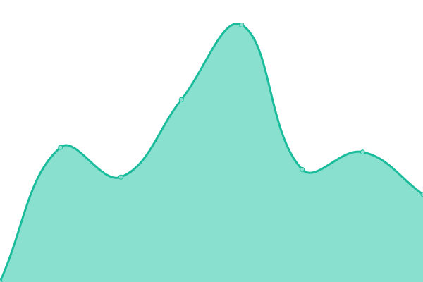
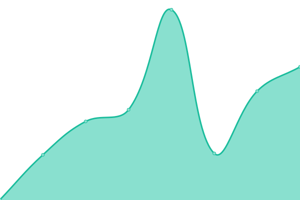

# [📈 Live Status](https://DaMnGoodIT.github.io/upptime): <!--live status--> **🟧 Partial outage**

This repository contains the open-source uptime monitor and status page for [DaMnGoodIT](https://damngoodit.de), powered by [Upptime](https://github.com/upptime/upptime).

With [Upptime](https://upptime.js.org), you can get your own unlimited and free uptime monitor and status page, powered entirely by a GitHub repository. We use [Issues](https://github.com/DaMnGoodIT/upptime/issues) as incident reports, [Actions](https://github.com/DaMnGoodIT/upptime/actions) as uptime monitors, and [Pages](https://DaMnGoodIT.github.io/upptime) for the status page.

<!--start: status pages-->
<!-- This summary is generated by Upptime (https://github.com/upptime/upptime) -->
<!-- Do not edit this manually, your changes will be overwritten -->
<!-- prettier-ignore -->
| URL | Status | History | Response Time | Uptime |
| --- | ------ | ------- | ------------- | ------ |
|  [Matrix - Synapse](https://matrix.b0t.at/health) | 🟩 Up | [matrix-synapse.yml](https://github.com/DaMnGoodIT/upptime/commits/HEAD/history/matrix-synapse.yml) | 

 812ms
     
 | 

<a href="https://status.b0t.at/history/matrix-synapse">100.00%</a>
    

|  [Matrix - Element Web](https://element.b0t.at) | 🟩 Up | [matrix-element-web.yml](https://github.com/DaMnGoodIT/upptime/commits/HEAD/history/matrix-element-web.yml) | 

 997ms
     
 | 

<a href="https://status.b0t.at/history/matrix-element-web">100.00%</a>
    

|  [Matrix - Element Call](https://call.b0t.at) | 🟩 Up | [matrix-element-call.yml](https://github.com/DaMnGoodIT/upptime/commits/HEAD/history/matrix-element-call.yml) | 

 900ms
     
 | 

<a href="https://status.b0t.at/history/matrix-element-call">100.00%</a>
    

|  [b0t.at](https://b0t.at) | 🟩 Up | [b0t-at.yml](https://github.com/DaMnGoodIT/upptime/commits/HEAD/history/b0t-at.yml) | 

 799ms
     
 | 

<a href="https://status.b0t.at/history/b0t-at">100.00%</a>
    

|  [Mastodon](https://social.b0t.at) | 🟩 Up | [mastodon.yml](https://github.com/DaMnGoodIT/upptime/commits/HEAD/history/mastodon.yml) | 

 869ms
     
 | 

<a href="https://status.b0t.at/history/mastodon">100.00%</a>
    

|  [Privatebin](https://bin.b0t.at) | 🟩 Up | [privatebin.yml](https://github.com/DaMnGoodIT/upptime/commits/HEAD/history/privatebin.yml) | 

 1106ms
     
 | 

<a href="https://status.b0t.at/history/privatebin">100.00%</a>
    

|  [MailU](https://mail.b0t.at) | 🟥 Down | [mail-u.yml](https://github.com/DaMnGoodIT/upptime/commits/HEAD/history/mail-u.yml) | 

 481ms
     
 | 

<a href="https://status.b0t.at/history/mail-u">42.54%</a>
    

|  [ExcaliDraw](https://draw.b0t.at) | 🟩 Up | [excali-draw.yml](https://github.com/DaMnGoodIT/upptime/commits/HEAD/history/excali-draw.yml) | 

 612ms
     
 | 

<a href="https://status.b0t.at/history/excali-draw">100.00%</a>
    

|  [Vaultwarden](https://vault.b0t.at) | 🟩 Up | [vaultwarden.yml](https://github.com/DaMnGoodIT/upptime/commits/HEAD/history/vaultwarden.yml) | 

 707ms
     
 | 

<a href="https://status.b0t.at/history/vaultwarden">100.00%</a>
    

|  [iWantACat](https://iwanta.cat) | 🟩 Up | [i-want-a-cat.yml](https://github.com/DaMnGoodIT/upptime/commits/HEAD/history/i-want-a-cat.yml) | 

 393ms
     
 | 

<a href="https://status.b0t.at/history/i-want-a-cat">100.00%</a>
    

|  [MyApps](https://apps.b0t.at) | 🟩 Up | [my-apps.yml](https://github.com/DaMnGoodIT/upptime/commits/HEAD/history/my-apps.yml) | 

 672ms
     
 | 

<a href="https://status.b0t.at/history/my-apps">100.00%</a>
    

|  [Open-WebUI](https://ai.b0t.at) | 🟩 Up | [open-web-ui.yml](https://github.com/DaMnGoodIT/upptime/commits/HEAD/history/open-web-ui.yml) | 

 694ms
     
 | 

<a href="https://status.b0t.at/history/open-web-ui">99.72%</a>
    

<!--end: status pages-->

[**Visit our status website →**](https://DaMnGoodIT.github.io/upptime)

## 📄 License

- Powered by: [Upptime](https://github.com/upptime/upptime)
- Code: [MIT](./LICENSE) © [DaMnGoodIT](https://damngoodit.de)
- Data in the `./history` directory: [Open Database License](https://opendatacommons.org/licenses/odbl/1-0/)
